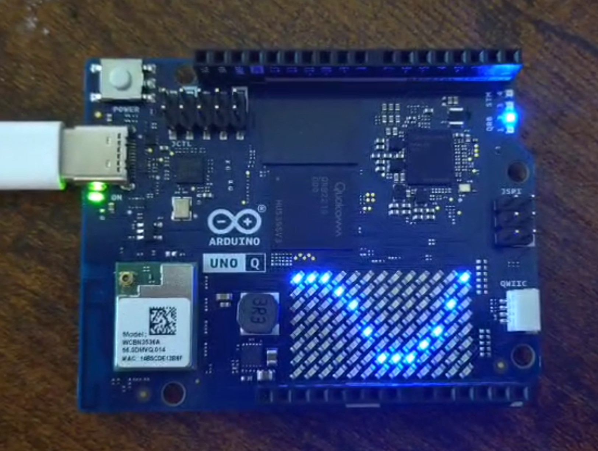

# Sine Wave Display on Arduino UNO Q

## 📌 Description
This project displays a sine wave on the 8x13 LED matrix of the Arduino UNO Q.

## ⚙️ How it works
- Each column represents a point in the sine function
- The column index is mapped to an angle (0 to 2π)
- The sine value (-1 to +1) is mapped to LED rows (0 to 7)

## 🧠 Key Concepts
- Mathematical function visualization
- Mapping continuous signals to discrete display
- Embedded systems programming

## 📂 Code Location
Arduino_Code\LED_Matrix_Display/LED_Matrix_Display.ino

## 🚀 Result
The LED matrix shows a moving sine wave using real-time computation.

## 📸 Demo

[Watch demo video](results/Sine_wave.mp4)